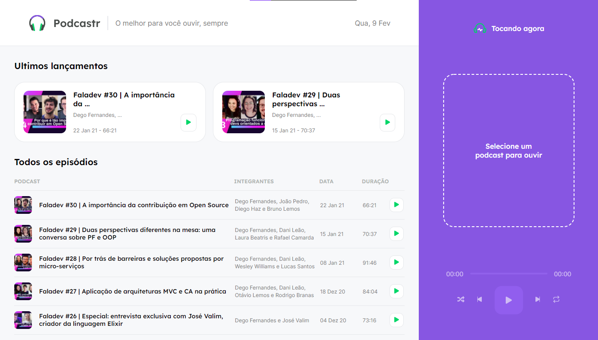
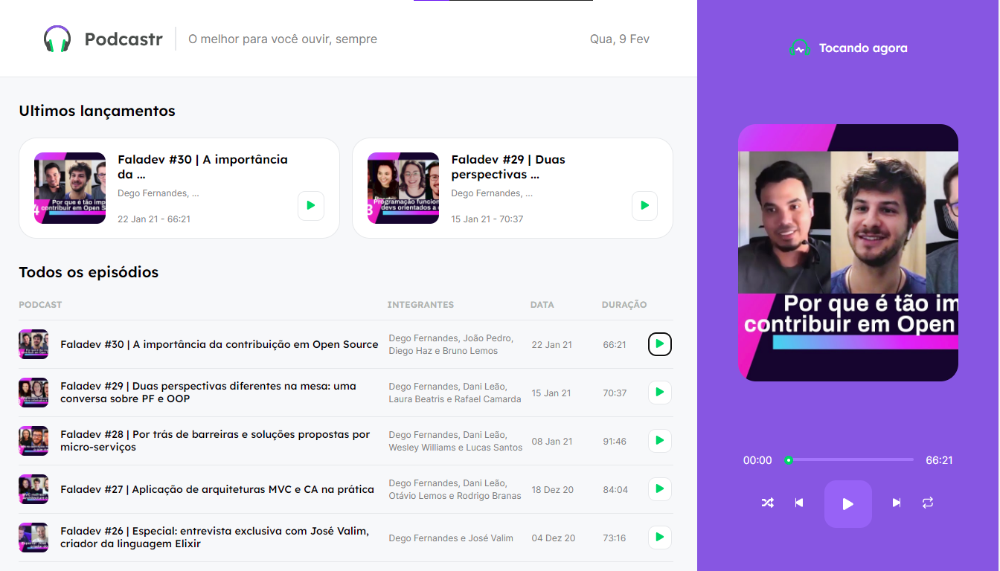
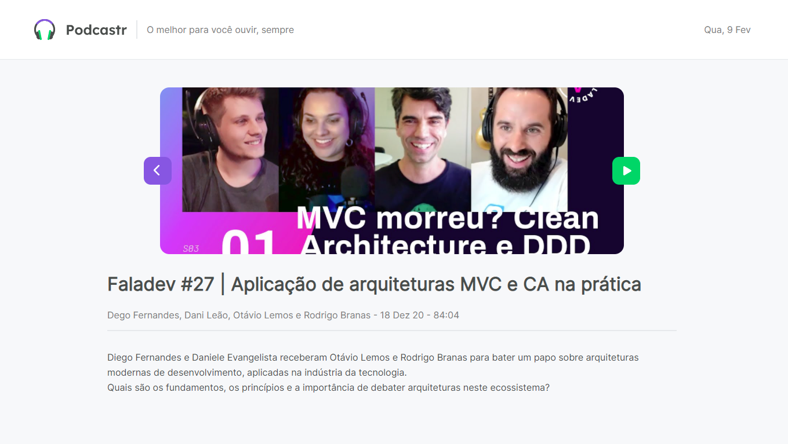

# Podcast Valley

This is a application of a podcast site, with custom audio player and list of all episodes.

## Screenshots





## Setup

Go to the desired folder and run

```bash
  $ git clone https://github.com/matheustsdev/podcast_valley.git

  $ cd podcast_valley
```

Then, install the packages and run the development server with:
(NPM)

```bash
  $ npm install

  $ npm run start
```

or: (YARN)

```bash
  $ yarn

  $ yarn start
```

And you're ready to go!

## Stack

**Front-end:** React, Typescript, Context API and Styled-Components.

## Autor

- Github: [@matheustsdev](https://github.com/matheustsdev)
- Linkedin: [Matheus Teixeira](https://www.linkedin.com/in/matheust0105/)
